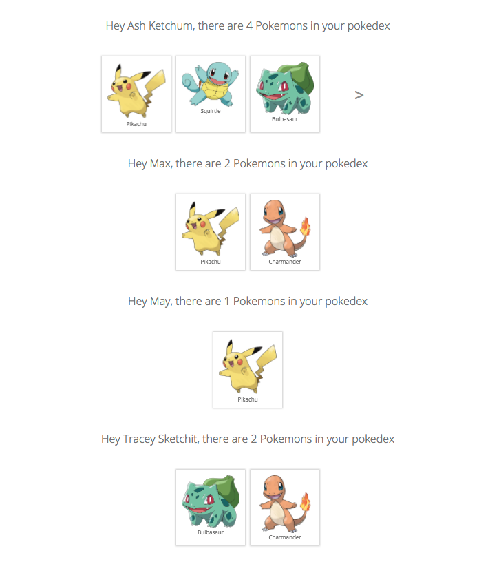

# Improving Performance with Apollo Query Batching

Apollo makes it easy to compose your application from individual components that manage their own data dependencies. This pattern enables you to grow your app and add new features without risk of breaking existing functionality. It does however come with a performance cost as each component will fire off uncoordinated GraphQL queries as they are being mounted by React.

In this article we will dive into transport-level query batching, an advanced Apollo feature that enables you to significantly improve performance of complex applications.

## The Example App

We will use an extended version of the [Learn Apollo](https://learnapollo.com) Pokedex app to explore the performance gains query batching can provide. The original Pokedex app lists all Pokemon for a single trainer. We make the app multi-tenant by rendering the Pokedex component for each trainer. This is how the app looks like with 6 trainers



To really stress test Apollo, we'll load each trainer twice!

## Measuring Performance using Chrome DevTools

Chrome DevTools has a very detailed network traffic inspection feature. If you are serious about app performance take a look at the [documentation](https://developers.google.com/web/tools/chrome-devtools/network-performance/resource-loading?utm_source=dcc&utm_medium=redirect&utm_campaign=2016q3). When you load the extended pokedex and filter for requests to the GraphQL backend it looks like this


The first thing you notice is that Apollo is generating 12 requests. This makes sense as we are rendering 12 Pokedex components. Each request takes around 100 ms and the first 6 requests completes within 126 ms. But now something interesting happens. The following 6 requests are stalled for up to 126 ms while the first requests complete. All browsers have a limit on [concurrent connections](http://www.browserscope.org/?category=network). For Chrome the limit is currently 6 concurrent requests to the same hostname, so 7 requests will take roughly double the amount of time to complete as 6 requests.

This is where Apollos Query Batching comes into play. If Query Batching is enabled, Apollo will not issue requests immediately. Instead it will wait for up to 10 ms to see if more requests come in from other components. After the 10 ms, Apollo will issue 1 request containing all the queries. This eliminates the issue with stalled connections and delivers significantly better performance


The performance of this combined query is almost as good as a single query from the first test.

## Enabling Apollo Query Batching

Enabling Query Batching is super simple. The original Pokedex app looked like this:

```js
import ApolloClient, { createNetworkInterface } from 'apollo-client'

const client = new ApolloClient({
  networkInterface: createNetworkInterface({ uri: 'https://api.graph.cool/simple/v1/ciybssqs700el0132puboqa9b'}),
  dataIdFromObject: o => o.id
})
```

To enable Query Batching, simply use the `BatchingNetworkInterface`:

```js
import ApolloClient, { createBatchingNetworkInterface } from 'apollo-client'

const client = new ApolloClient({
    networkInterface: createBatchingNetworkInterface({
    uri: 'https://api.graph.cool/simple/v1/ciybssqs700el0132puboqa9b',
    batchInterval: 10
  }),
  dataIdFromObject: o => o.id
})
```

Query Batching is supported out of the box by the [Apollo Server](https://github.com/apollostack/graphql-server) and [Graphcool](https://www.graph.cool/).

## Under the hood

If you are familiar with the GraphQL specification you might be wondering how Apollo is able to batch 12 queries into one. Let's have a look at what actually goes over the wire.

A single request without Batching:

```json
{
  "query": "query TrainerQuery($name: String!, $first: Int!, $skip: Int!) {  Trainer(name: $name) {    id    name    ownedPokemons(first: $first, skip: $skip) {      id      name      url      __typename    }    _ownedPokemonsMeta {      count      __typename    }    __typename  }}",
  "variables": {
    "name": "Ash Ketchum",
    "skip": 0,
    "first": 3
  },
  "operationName": "TrainerQuery"
}
```

12 batched requests:

```json
[
  {
    "query": "query TrainerQuery($name: String!, $first: Int!, $skip: Int!) {  Trainer(name: $name) {    id    name    ownedPokemons(first: $first, skip: $skip) {      id      name      url      __typename    }    _ownedPokemonsMeta {      count      __typename    }    __typename  }}",
    "variables": {
      "name": "Ash Ketchum",
      "skip": 0,
      "first": 3
    },
    "operationName": "TrainerQuery"
  },
  {
    "query": "query TrainerQuery($name: String!, $first: Int!, $skip: Int!) {  Trainer(name: $name) {    id    name    ownedPokemons(first: $first, skip: $skip) {      id      name      url      __typename    }    _ownedPokemonsMeta {      count      __typename    }    __typename  }}",
    "variables": {
      "name": "Max",
      "skip": 0,
      "first": 3
    },
    "operationName": "TrainerQuery"
  },
  [ 10 additional queries ]
]
```

normal response:

```json
{
  "data": {
    "Trainer": {
      "name": "Ash Ketchum",
      "__typename": "Trainer",
      "ownedPokemons": [{
        "id": "ciwnmyvxn94uo0161477dicbm",
        "name": "Pikachu",
        "url": "http://cdn.bulbagarden.net/upload/thumb/0/0d/025Pikachu.png/600px-025Pikachu.png",
        "__typename": "Pokemon"
      }, {
        "id": "ciwnmzhwn953o0161h7vwlhdw",
        "name": "Squirtle",
        "url": "http://cdn.bulbagarden.net/media/upload/1/15/007Squirtle_XY_anime.png",
        "__typename": "Pokemon"
      }, {
        "id": "ciwnn0kxq95oy0161ib2wu50g",
        "name": "Bulbasaur",
        "url": "http://cdn.bulbagarden.net/media/upload/thumb/e/ea/001Bulbasaur_AG_anime.png/654px-001Bulbasaur_AG_anime.png",
        "__typename": "Pokemon"
      }],
      "_ownedPokemonsMeta": {
        "count": 4,
        "__typename": "_QueryMeta"
      },
      "id": "ciwnmyn2a9ayt0175axsnyux1"
    }
  }
}
```

batched response:

```json
[{
  "data": {
    "Trainer": {
      "name": "Ash Ketchum",
      "__typename": "Trainer",
      "ownedPokemons": [{
        "id": "ciwnmyvxn94uo0161477dicbm",
        "name": "Pikachu",
        "url": "http://cdn.bulbagarden.net/upload/thumb/0/0d/025Pikachu.png/600px-025Pikachu.png",
        "__typename": "Pokemon"
      }, {
        "id": "ciwnmzhwn953o0161h7vwlhdw",
        "name": "Squirtle",
        "url": "http://cdn.bulbagarden.net/media/upload/1/15/007Squirtle_XY_anime.png",
        "__typename": "Pokemon"
      }, {
        "id": "ciwnn0kxq95oy0161ib2wu50g",
        "name": "Bulbasaur",
        "url": "http://cdn.bulbagarden.net/media/upload/thumb/e/ea/001Bulbasaur_AG_anime.png/654px-001Bulbasaur_AG_anime.png",
        "__typename": "Pokemon"
      }],
      "_ownedPokemonsMeta": {
        "count": 4,
        "__typename": "_QueryMeta"
      },
      "id": "ciwnmyn2a9ayt0175axsnyux1"
    }
  }
},
  // [ 11 additional responses ]
]
```

## Query deduplication

Enabling Query Batching already provided a significant boost to performance. Can we do even better? Remember how the `BatchingNetworkInterface` queued up all requests for a predetermined amount of time before sending them all in one batch. Query deduplication takes this a step further and inspects all queries in the batch to find and remove duplicates. Let's see how this affects our performance:


As you can see the request size is slightly smaller and the request is now just as fast as a single unbatched request.

Please be aware that both Query Batching and query de-duplication are recent features in Apollo, so make sure you are using the latest version.

Do you have questions about Query Batching using Apollo Client?
Tell us in our [Slack channel](http://slack.graph.cool/) to start a discussion. If you want to benefit from Query Batching, setup your own GraphQL backend in less than 5 minutes on [Graphcool](https://graph.cool/).
