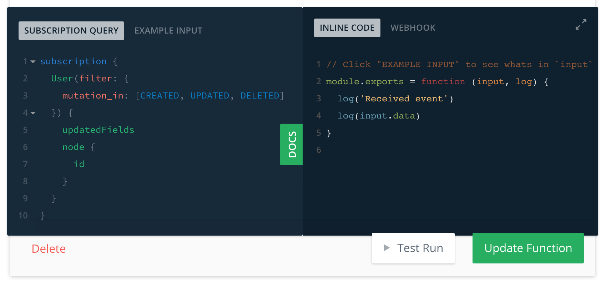
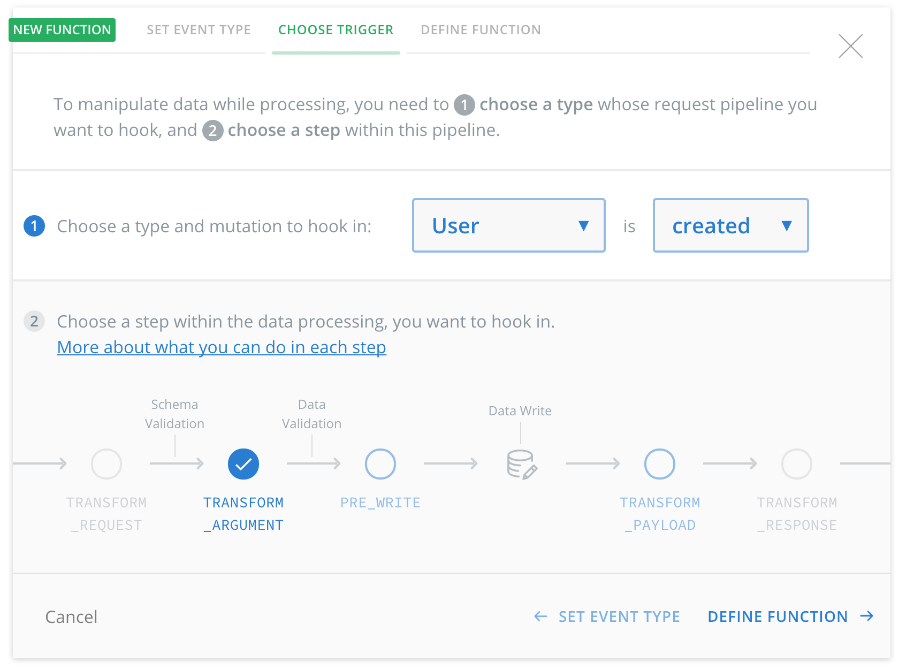

# Introducing a CLI & Functions

Today we are announcing two new major additions to the Graphcool platform: Graphcool CLI and Functions. Together, these features enable you to extend your GraphQL API in new and powerful ways while introducing a significantly improved development workflow.

## A Local Development Workflow with the Graphcool CLI

We have consistently received feedback from our developer community that while working with the web-based Graphcool Console is easy, more advanced tools are required to manage projects as they grow in complexity.

The most requested features were:

* Keeping your schema in version control
* Performing multiple changes in a single migration
* Deploying the same schema to separate environments for staging and production

All of these and many more use cases are enabled through the new Graphcool CLI. Here is a quick preview of what it looks like:


### Getting Started with the CLI

You can get started in seconds by installing the CLI and listing your current projects:

```sh
# Install the CLI
npm install -g graphcool
# Show all projects
graphcool projects
```

When creating a new project, the CLI will create a local `project.graphcool` file:

```sh
graphcool init
```

You can change your schema by editing the `project.graphcool` file locally and running `graphcool push` to deploy your changes:

```graphql
type Post {
    title: String
    body: String!
    comments: [Comment!]! @relation(name: "Comments")
}

type Comment {
    text: String!
    post: Post @relation(name: "Comments")
}
```


The CLI is self-documented, so you can dive right in. We also have [comprehensive documentation](!alias-kie1quohli) available.


## Implementing Business Logic with Serverless Functions

Today we are announcing three new features that allow you to leverage the power of Serverless functions.

### Writing Functions Directly in the Console

We have partnered with Auth0 Extend to enable you to write your functions directly in the Graphcool Console. Inline functions can be created in seconds and the integrated testing workflow and execution logs make it easy to implement and debug new business logic.



### Server-side Subscriptions Replace Mutation Callbacks

The current mutation callback API has been with us from the very beginning, enabling you to implement business logic such as sending a welcome mail to new users or charging a credit card when an order is placed. We have received many suggestions on how we could improve it, and when we implemented the GraphQL Subscriptions API late last year we took all this feedback into account.

Today we are changing the API for mutation callbacks to align with GraphQL subscriptions and rebrand the feature to Server-side Subscriptions. Server-side Subscriptions can trigger a webhook or an inline serverless function and benefit from the extensive Subscription API.

### Implementing Data Validation and Transformation

One of the most highly requested features is the ability to add data validation for specific fields. The Request Pipeline is a powerful programming model that allows you to do that and much more.

With the request pipeline you can for example:

* Validate the format of a shipping address
* Sanitise and normalise user input
* Retrieve extra information from an external system

The request pipeline allows you to write functions that hook into the processing of a mutation at 3 different stages.



* Hook into `TRANSFORM_ARGUMENT` to perform data validation or transform data before it is stored in the database
* Hook into `PRE_WRITE` to call external systems after data validation, but before data is stored in the database
* Hook into `TRANSFORM_PAYLOAD` if you need to transform the data that is returned from a mutation, but not what is stored in the database.

Read our [detailed documentation](!alias-pa6guruhaf) to get started with the request pipeline, or dive into our blog post [Introducting the Serverless GraphQL Backend Architecture](!alias-ahde7paig2).

### Bonus-feature: HTTP Headers for Webhooks

A small, but highly requested feature is the ability to add HTTP headers to webhooks. This feature enables you to secure your webhooks by including an Authorization header or connect directly to external systems that require special headers.
