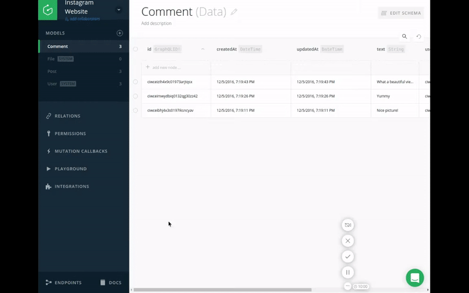

# Connecting to a GraphQL Server in Two Simple Steps

Connecting your application to a GraphQL server can be done in two simple steps.

## Get the GraphQL Endpoint

First of all, you need the endpoint that you want to connect to. You can copy it from within your Console:



```js
const GRAPHQL_ENDPOINT = 'https://api.graph.cool/simple/v1/__PROJECT_ID__'
const RELAY_ENDPOINT = 'https://api.graph.cool/relay/v1/__PROJECT_ID__'
```

## Setting up your GraphQL Client

Now initialize the GraphQL client you want to use with the endpoint.

### Apollo Client

Initialize the network interface of Apollo Client with the GraphQL endpoint:

```js
import ApolloClient, { createNetworkInterface } from 'apollo-client'

const client = new ApolloClient({
  networkInterface: createNetworkInterface({ uri: GRAPHQL_ENDPOINT }),
})
```

<!-- GITHUB_EXAMPLE('Instagram Example with Apollo', 'https://github.com/graphcool-examples/react-apollo-instagram-example') -->

### Relay

Initialize the network layer if Relay with the Relay endpoint:

```js
import Relay from 'react-relay'

Relay.injectNetworkLayer(
  new Relay.DefaultNetworkLayer(RELAY_ENDPOINT)
)
```

<!-- GITHUB_EXAMPLE('Instagram Example with Relay', 'https://github.com/graphcool-examples/relay-apollo-instagram-example') -->

### Lokka

Initialize the transport of Lokka with the GraphQL endpoint:

```js
import { Lokka } from 'lokka'
import { Transport } from 'lokka-transport-http'

const transport = new Transport(GRAPHQL_ENDPOINT)
const client = new Lokka({ transport })
```

<!-- GITHUB_EXAMPLE('Todo Example with Lokka', 'https://github.com/graphcool-examples/react-lokka-todo-example') -->
