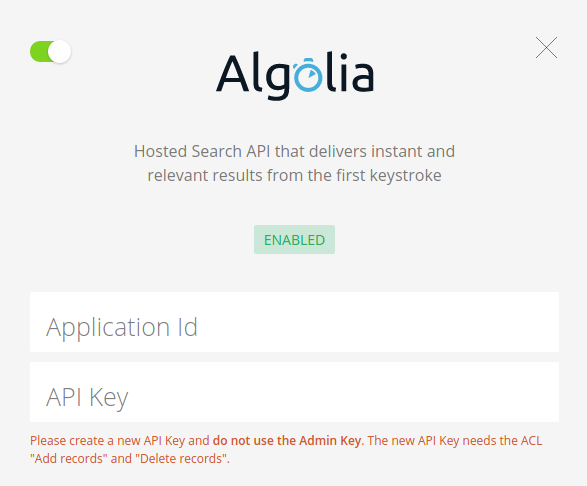
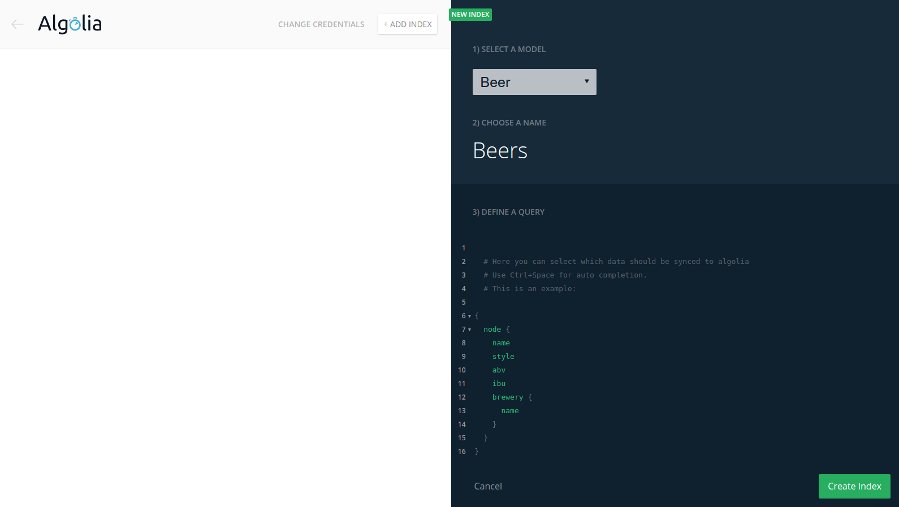

# Algolia Auto-Sync for GraphQL backends

Algolia Instant Search allows you to create an intuitive and fast search experience for your website. Using the Algolia integration, you can get started with using Algolia in minutes. In this tutorial we'll integrate a GraphQL backend with Algolia to automatically synchronize changes to your data to Algolia search indices.

We will see how to create Algolia search indices and keep them synchronized whenever the underlying data changes.
Check [the live demo](http://algolia-graphql.netlify.com) or the [complete code on GitHub](https://github.com/graphcool-examples/algolia-brewery-example).

## Introduction

Imagine we are running an online catalog for draft beer webshop and the producing breweries.

For each beer, we store the `name`, `style` and `ibu` (bitterness value) and `abv` (alcohol by volume) as well as the selling brewery. A brewery has a `name` and a `city`.

> Note: in this tutorial, we'll use data from [Craft Cans](http://craftcans.com/) as described [here](http://www.jeannicholashould.com/python-web-scraping-tutorial-for-craft-beers.html).

Let's explore the available beer in our first brewery:

```graphql
---
endpoint: https://api.graph.cool/simple/v1/ciypopbp04gjw01328iph19uo
disabled: false
---
query {
  allBreweries(
    first: 1
  ) {
    name
    city
    beers {
      name
      style
      abv
      ibu
    }
  }
}
---
{
  "data": {
    "allBreweries": [
      {
        "name": "Blackrocks Brewery",
        "city": "Marquette",
        "beers": [
          {
            "name": "North Third Stout",
            "style": "Foreign / Export Stout",
            "abv": "0.06",
            "ibu": "30.0"
          },
          {
            "name": "Nordskye ",
            "style": "American IPA",
            "abv": "0.048",
            "ibu": "47.0"
          },
          {
            "name": "Honey Lav",
            "style": "American Pale Wheat Ale",
            "abv": "0.052000000000000005",
            "ibu": ""
          },
          {
            "name": "Coconut Brown Ale",
            "style": "American Brown Ale",
            "abv": "0.068",
            "ibu": ""
          },
          {
            "name": "Grand Rabbits",
            "style": "Cream Ale",
            "abv": "0.055",
            "ibu": ""
          },
          {
            "name": "51K IPA",
            "style": "American IPA",
            "abv": "0.07",
            "ibu": "51.0"
          }
        ]
      }
    ]
  }
}
```

Now we want to use Algolia to build a search experience for our marketplace website. One approach is to create an Algolia search index and then periodically synchronize the data from our GraphQL project to Algolia. But can we do better?

## Creating Algolia Search Indices

Let's see how to create a new Algolia search index. On the integration page, you first have to enter your Algolia credentials:

* **Application ID**: you can copy the application id from your Algolia account
* **API Key**: Please create a new API Key and do not use the Admin Key. The new API Key needs the ACL *Add records* and *Delete records*.



Then you can create a new index on the `Beer` model. Name the index `Beers` and enter this query:

```graphql
{
  node {
    name
    style
    abv
    ibu
    brewery {
      name
    }
  }
}
```



This GraphQL query defines the structure of the Algolia search index that we called `Beers`. **Creating a search index results in a one-time synchronisation** of all `Beer` nodes with the selected fields. Additionally, **every created or updated node is automatically synchronized** as well!

Using Algolia search indices, we have different kinds of attributes:

* *searchable attributes* that are used to determine which results should be shown
* `presentational attributes` that are only needed to display a result, but users cannot search for these attributes to display a certain result

In general, you can use the `Rankings` settings for your Algolia index to control searchable and presentational attributes. By default, all attributes in an index are searchable.

## Fine Control Over Synced Records

When defining an index, you can use filters in the index query to get fine control over which records will be synchronized. In this example, we're building an index for a specific shop. Create a new index called `ChampionBrewery` on the `Beer` model and enter this query:

```graphql
{
  node(filter: {
    brewery: {
      name: "Champion Brewing Company"
    }
  }) {
    name
    style
    brewery {
      name
      city
    }
  }
}
```

Now only nodes that are available in the `Champion Brewing Company` are synchronized to the newly created Algolia index `ChampionBrewery`.

## Algolia Geosearch

We can also Algolia Geosearch with this setup. To make that work, you need a special setup based on Algolia's API:

* the location values need to be stored in a location model with the fields `lng` and `lat` of type float
* when defining the search index, you need to use an alias `_geoloc` for nested location model

For example, if we wanted to do a location search for shops, we could define this Algolia index query on the `Shop` model:

```graphql
{
  node {
    name
    _geoloc: location {
      lng
      lat
    }
  }
}
```

See [here](https://www.algolia.com/doc/guides/geo-search/geo-search-overview/) for more information on Algolia Geosearch.

## Conclusion

Using the Algolia integration, it's easy to create a wonderful search experience for your websites based on data in a GraphQL backend. You can create an Algolia index by specifying the data you need with a GraphQL query and changes to your data are automatically synchronized with the Algolia search index.

If you want to get started with Algolia, you can check [the live demo](http://algolia-graphql.netlify.com) or the [complete code on GitHub](https://github.com/graphcool-examples/algolia-brewery-example).
