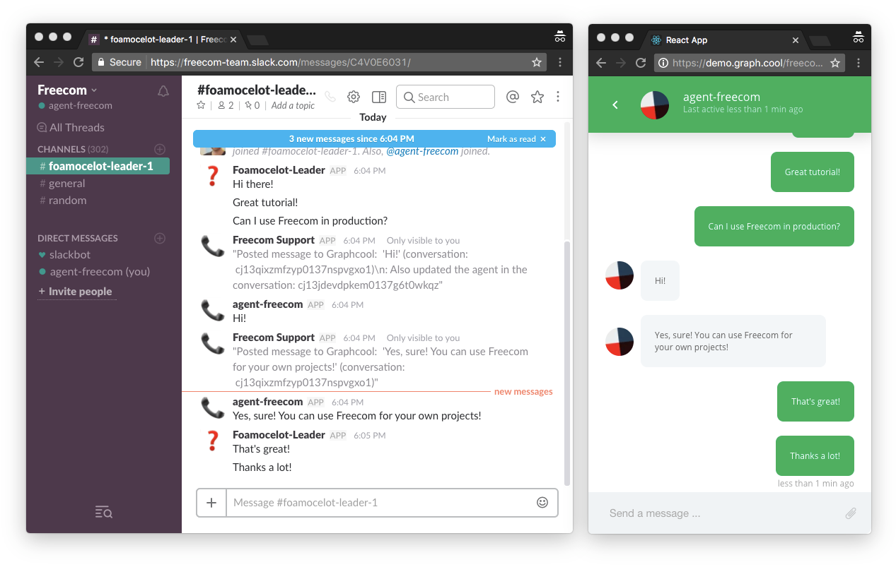

# Freecom: Building Intercom with GraphQL and Apollo (Overview)

<iframe height="315" src="https://www.youtube.com/embed/E3dRRSIyNjc?list=PLn2e1F9Rfr6lF80_-VUDlZir2GIoW32Lo" frameborder="0" allowfullscreen></iframe>

Everybody loves the live chat experience of [Intercom](www.intercom.com), but for many early-stage startups and projects the pricing can be a problem. To demonstrate how you can build a _production-ready_ alternative to Intercom all by yourself, we're happy to announce a new full-stack tutorial series: **Freecom**  🎉🍾

## Learning by Building

In the next couple of weeks, we are going to release increments of the final product along with tutorial chapters, teaching you how to build a fully-fledged application from scratch. Freecom will be powered by a Graphcool backend, thus making it a perfect opportunity for you to get started with [GraphQL](www.graphql.org) while discovering all major functionality of the Graphcool platform!

The final project not only can be used in production, it also is a great reference project and starting point for your next GraphQL app!

## The "Stack"

As already mentioned, on the backend we are going to use a GraphQL API by Graphcool, connecting to its [Simple API](!alias-heshoov3ai/).

For the frontend, we are choosing a modern and easy-to-get-started set of technologies!

The view layer of Freecom will be implemented in [React](https://facebook.github.io/react/). Then, for the interaction with the GraphQL server we are using [Apollo](http://dev.apollodata.com/), a sophisticated GraphQL client that implements features like caching, optimistic UI and realtime subscriptions, thus making it perfect for our use case. [React and Apollo play nicely together](http://dev.apollodata.com/react/#react-toolbox) and make interaction with a GraphQL API a breeze 🚀  

To have a head start with our project and save ourselves some configuration time, we'll be using [create-react-app](https://github.com/facebookincubator/create-react-app) to create our initial project. This will generate a boilerplate React project with [JSX](https://jsx.github.io/), [ES6](http://es6-features.org/) and [Flow](https://flow.org/) support as well as some other [handy configurations](https://github.com/facebookincubator/create-react-app#why-use-this).

## Demo: Try out the final product

As mentioned before, you'll be able to up your support game after this tutorial and use the final product in your own website to help your customers! You and your support agents will be able to answer customer questions through a dedicated Slack team.

If you want to get a taste of what the final version looks like, you can go [here for a hosted demo](https://demo.graph.cool/freecom/), play the role of a customer and ask some support questions. If you'd like to put on the shoes of a support agent, you can log in to the [Demo Slack account](https://freecom-team.slack.com) with the following data:

- Email: `freecom-agent@graph.cool`
- Password: `freecom`

## Tutorial Curriculum

Here is a brief overview of the tutorial chapters to come:

In the [_1st chapter_](!alias-e8a6ajt8ax), we start by discussing the **concrete requirements** for the app and **develop a [GraphQL schema](!alias-xuakjj68lp/)** that we can use to set up our API. Watch the [video](https://www.youtube.com/watch?v=4q0fFEypacA).

The [_2nd chapter_](!alias-oe8ahyo2ei) explains how to **integrate the [Apollo](http://dev.apollodata.com/react/) client** into the app so that it can interact with our API using **queries and mutations**. Watch the [video](https://www.youtube.com/watch?v=ZItsQWNPw1U).

The _3rd chapter_ is all about bringing **realtime functionality** into our chat, this can be achieved using [**GraphQL subscriptions**](!alias-aip7oojeiv/). We'll explain how you can integrate subscriptions in Freecom to make the messages appear without the user refreshing the page.

In the _4th chapter_, we'll use the [**permission system**](!alias-iegoo0heez/) to make sure customers can only ever view their own messages.

Our support chat will enable the support agents to chat with customers through [Slack](https://slack.com/). In the _5th chapter_, we'll therefore explain how to use **[mutation callbacks](!alias-ahlohd8ohn/) and [serverless functions](https://stdlib.com/)** to integrate with the Slack API.

Finally, in the _6th chapter_, we are going to cover how to **[upload files](!alias-eer4wiang0/)** and do proper file management in a Graphcool backend.

## Getting Started 🚀

We already provide all needed UI components, so you can focus on using GraphQL with Apollo and implementing the business logic.

The chapters are deep dives into the relevant concepts that are needed to implement the required functionality. Our goal is to provide you with the right background information to be able to build the functionality yourself. To make this easier, there will be a _starter_ and a _final_ project for every chapter, so you'll have plenty of code to look at and draw inspiration from for your own projects!

> If you're looking for a comprehensive _step-by-step_ tutorial, definitely check out the [Learn Apollo](www.learnapollo.com) tutorial series.

Click [here](!alias-xuakjj68lp) for the first chapter of your tutorial series where we analyse requirements and develop the data model for Freecom.

<!-- FREECOM_SIGNUP -->
