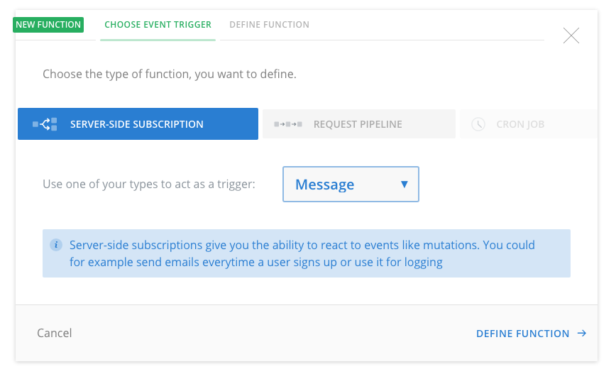
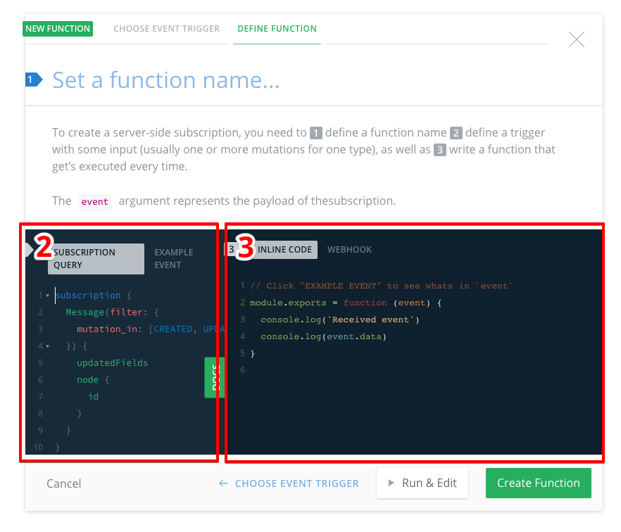

# Business Logic with Serverless Functions

This is the fifth chapter of our Freecom tutorial series and it's all about extending the capabilities of Graphcool by integrating with third-party services. We are going to use serverless functions in order to connect Freecom with Slack and thus enable communication between customers and support agents. In the [previous chapter](!-pei9aid6ei), you learned how to implement authentication and permission rules to ensure customers only have access to their own conversations.

<iframe height="315" src="https://www.youtube.com/embed/CNAtCbTjfT8" frameborder="0" allowfullscreen></iframe>


## What are Serverless Functions?

Before we dive into the details of how to use serverless functions with Graphcool, let's do a quick review of what serverless functions actually are.

[Serverless Functions](https://en.wikipedia.org/wiki/Serverless_computing), also referred to as Functions as a Service (FaaS), enable developers to write and deploy independent pieces of functionality without having to deal with setting up and configuring the server environment. In that sense, they are similar to microservices, where each function represents one microservice, but again, without the developer having to deal with configuration or deployment overhead. Instead, they can take advantage of the server infrastructures of FaaS providers such as [AWS Lambda](https://serverless.com/framework/docs/providers/aws/guide/functions/), [Google Cloud Functions](https://cloud.google.com/functions/), [Microsoft Azure Functions](https://azure.microsoft.com/en-us/services/functions/) or [StdLib](https://stdlib.com/).

> Fundamentally FaaS is about running back end code without managing your own server systems or your own server applications. That second clause - server applications - is a key difference when comparing with other modern architectural trends like containers and PaaS (Platform as a Service.) 
> 
>  **Martin Fowler** on [Serverless Architectures](https://martinfowler.com/articles/serverless.html)


## Freecom Requirements

In Freecom, support agents are using Slack while customers are chatting via the Freecom React app that we've been building over the last couple of chapters.

There generally are three pieces of functionality where we need to integrate with the Slack API:

1. Creating a new Slack channel when a customer initiates a new conversation
2. Forwarding a message from the Freecom React App to Slack (_customer writes to agent_)
3. Forwarding a message from Slack to the Freecom React App (_agent writes to customer_)

In this chapter, we'll only cover the first two use cases since these are the parts that we can implement in the Graphcool backend. For the third one we'll have to use a dedicated FaaS provider.


## Using Functions with Graphcool

[Functions](!alias-boo6uteemo) are a Graphcool feature that allow the developer to implement custom business logic in the backend. Generally, that can be done by either specifying a _webhook_ (e.g. to call a custom microservice or another API) or by writing the function directly _inline_ in the Graphcool console.

There are two types of functions available on the Graphcool platform:

- **Request Pipeline**: Enables transformation and validation of the input and output of a mutation.
- **Server-side Subscriptions**: Similar to subscriptions on the frontend, these are triggered based on _events_ happening on a specific type, e.g. when a new `Message` is created.

> Note: In this Freecom chapter, we'll only deal with Server-side Subscriptions.

When setting up a server-side subscription, you have to go through three major steps:

1. Specify the _event trigger_, i.e. the _type_ for your subscription, e.g. `Message`.
    
2. Write the subscription query including the _payload_.
3. Write the actual function that will be executed when the subscription fires.
    
    
A server-side subscription function takes exactly one input argument, namely the `event` that triggered it. This event carries the _payload_ from the subscription query.  

A simple example of a subscription query could look as follows:

```graphql
subscription {
  Message(filter: {
    mutation_in: [CREATED]
  }) {
    node {
      text
    }
  }
}
``` 

Now a function that would just log the `text` of the new `Message` can be written like so:

```js
module.exports = function (event) {
  console.log(`New message created: ${event.data.Message.node.text}`)
}
```


## Forwarding a Message to Slack

Before we go into detail about how to use server-side subscriptions in order to connect our app to Slack, let's take a quick look at the visualization of the flow that is happening when a user hits return to send a message in the chat:


Here's a brief outline of the interaction that takes place:

1. The customer types a message and hits the return key
2. Apollo takes the `text` and the `conversationId` and sends this information to the Graphcool backend in the form of a `createMessage` mutation
3. The mutation is performed and the message is saved in the database
4. The server-side subscription for the `Message` type is triggered
5. The corresponding function is invoked
6. The function receives the subscription payload and uses it to invoke the Slack API, passing the `channel`, `username` and `text` as arguments
6. The Slack API receives the request and posts the message into the specified `channel` where the support agent can reply

In the following, we'll explain the steps that are required for this functionality.

### 1. Setting up a Server-side Subscription

#### Preparation

In the [Graphcool Console](https://console.graph.cool), you first need to select the **Functions** tab in the left side-menu and then click the **New Function** button on top.

On the first tab of the popup, you need to select the _type_ of function you want to setup, in our case that's the Server-Side Subscription and our trigger type is the `Message` type, since we want to invoke the function after a new `Message` was saved to the database. You can then move to the next tab **Define Function**.

#### Writing the Subscription Query

The next step is to define the subscription query, i.e. specify the payload that our function should receive as an input. The Slack API where we want to forward the message needs three bits of information:

- The name of the _channel_ where to post the message
- The _username_ of the person who posted it
- The _text_ of the message

The _name_ of the Slack channel is composed of the name of the corresponding `Customer` and the index of the conversation where that message is sent, e.g. `cool-tomato-3` is the third conversation of the `Customer` named `cool-tomato`.

Based on this information, we can write the subscription query as follows:

```graphql
subscription {
  Message(filter: {
    mutation_in: [CREATED]
  }) {
    node {
      text
      conversation {
        slackChannelIndex
        customer {
          name
        }
      }
    }
  }
}
```

This will gives us all the information we need to extract the data that's required by Slack.

However, there's a small gotcha with this query because it will also fire for messages that are sent by agents! In fact, when a message was sent by an agent through Slack, we _also_ want to post it to Slack again. That's because agents will use a Slack _slash command_ to send messages. This means that a message sent by agent `A` will not be seen by agent `B` despite them being in the same channel. So, this is why in the case where a new message was created by an agent in Slack directly, we still want to "repost" it to Slack.

We thus simply have to include the `agent` as a potential sender of the `Message` in the payload as well:

```
subscription {
  Message(filter: {
    mutation_in: [CREATED]
  }) {
    node {
      text
      conversation {
        slackChannelIndex
        customer {
          name
        }
      }
      agent {
        slackUserName
      }
    }
  }
}
```


#### Implementing the Function to forward the Message to the Slack API

The endpoint we need to forward the message to is [`https://api.slack.com/methods/chat.postMessage`](https://api.slack.com/methods/chat.postMessage). Each call to the Slack Web API neets to be authenticated using an [OAuth](https://api.slack.com/docs/oauth) token. We'll explain in the next section how to generate this token for your Slack team, so hold tight for a bit.

With every call we're making to the Slack API, we have to send our authentication `token` as well as the three arguments mentioned above: `channel`, `text` and `username`.

Based on the payload we specified in the previous step, we can write the function as follows:

```js
require('isomorphic-fetch')

module.exports = function (event) {

  // 1. Extract information from event payload
  const username = event.data.Message.node.agent ?
    event.data.Message.node.agent.slackUserName : event.data.Message.node.conversation.customer.name
  const text = event.data.Message.node.text
  const customerName = event.data.Message.node.conversation.customer.name.toLowerCase()
  const slackChannelName = `${customerName}-${event.data.Message.node.conversation.slackChannelIndex}`
  
  // 2. Call Slack API
  const emoji = event.data.Message.node.agent ? ':telephone_receiver:' : ':question:'
  const slackURL = `https://slack.com/api/chat.postMessage?token=${token}&channel=${slackChannelName}&username=${username}&text=${text}&icon_emoji=${emoji}`
  fetch(slackURL)
}
```

### 2. Getting started with the Slack Web API

There are two major things you need to do in order to use Freecom with your own Slack team:

1. Getting an authentication token to authenticate calls to the Slack Web API
2. Configuring the `/fc` Slash command in your Slack team

#### Getting your Authentication Token

If you don't yet have a Slack team that you want to use for Freecom, you can go and create a new team [here](https://slack.com/create).

In order to get your authentication, you can simply go to [https://api.slack.com/custom-integrations/legacy-tokens](https://api.slack.com/custom-integrations/legacy-tokens) and create a new token there by clicking on **Request Token** for the team that you want:


Once you've got this token, you have to set it in the above URL that we use to post a message to Slack.


#### Setting up the Slash Command

The support agents will be able to normally use Slack and chat with each other in your team. Whenever they want to send a message to a customer though, they can simply use the Slack [_slash command_](https://api.slack.com/slash-commands) that we are going to create in order to make sure their message is being forwarded to the customer. 

##### Creating a Slash Command for your Slack Team

The path for creating a slash command for your Slack team is actually not obvious, follow these steps to get there:

1. Go to your team settings on Slack that you can find with this URL: `https://__YOUR_TEAM__.slack.com/apps/manage/custom-integrations`
2. Click **Build** in the top-right corner
3. Click **Start Building** in the center
4. If the there is a popup prompting you to create a new app, simply click **Cancel**
5. In the left side-bar, in the section **Appp features**, click **Slack commands**
6. Scroll down to the very bottom of the page and in the last section titled **Attaching your custom command to an app**, click the highlighted link in the first bullet point that says: "Start with a **custom command** on yout own team. test it on your team and amke sure the experience feels right."
7. You're now prompted to specify the slash command, so simply type `/fc` into the text field and click **Add Slash Command Integration**


##### Configuring the Slash Command

Now that you created the slash command, you only need to configure it. 

The only required information you need to provide though is the **URL** for HTTP endpoint that should be invoked whenever someone in the Slack team uses the slash command. This needs to be the URL of your StdLib function `forward-from-slack` and will be of the form: `https://__YOUR_STDLIB_USERNAME__.stdlib.com/forward-from-slack@dev`.

Finally, click the **Save Integration** button on the bottom of the page, your slash command is now available in the Slack team! 🚀


## Wrap up

In this chapter, you learned how to integrate external services with Graphcool. External services can be called through _serverless functions_ that you can write directly in the Graphcool Console.

In the case of Freecom, we want to forward the customers' messages that are stored in the database to the Slack API so the support agents can respond. We saw how you can implement this requirement by setting up a server-side subscription that is fired every time a new `Message` is created.

The next and last chapter of the Freecom series will deal with file management.

Let us know how you like the tutorial or ask any questions you might have. Contact us on [Twitter](https://twitter.com/graphcool) or join our growing community on [Slack](http://slack.graph.cool/)!

<!-- FREECOM_SIGNUP -->

