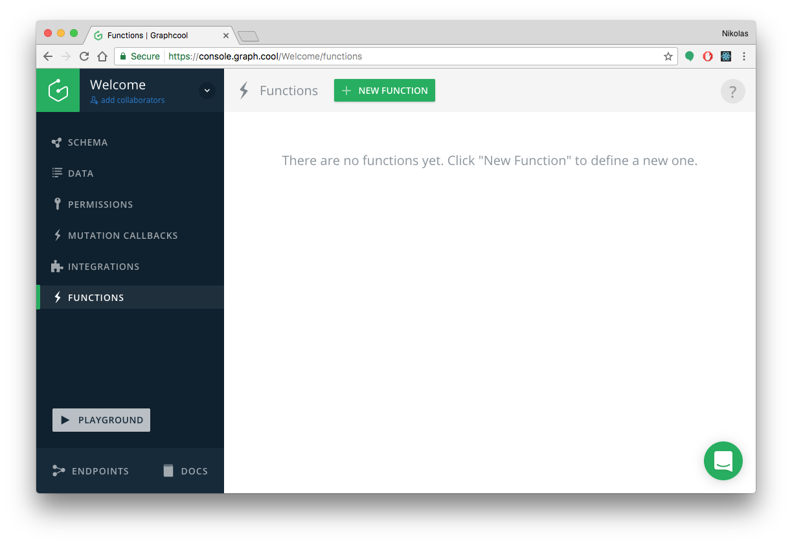
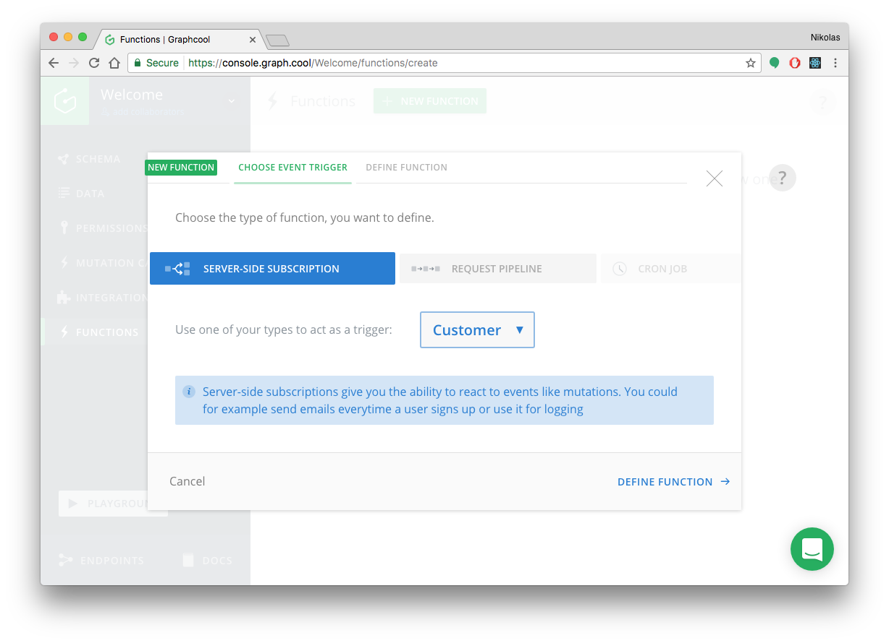
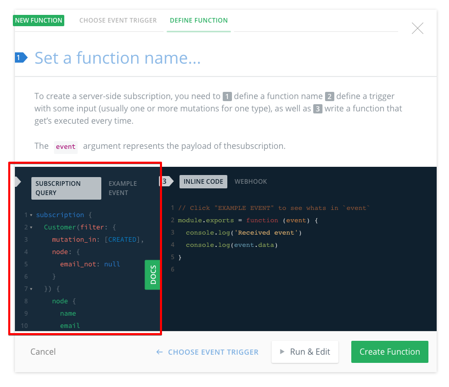
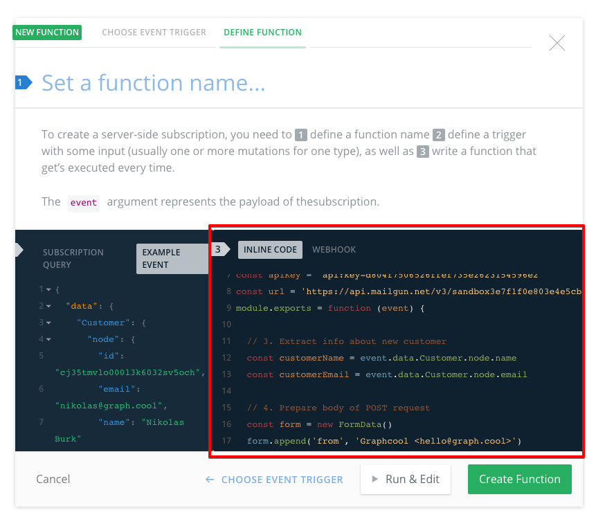

# Using Server-side Subscriptions to Send a Welcome Email

In this article, you'll learn how to use serverless functions to send a welcome email to new users that are signing up with your app.

<iframe width="560" height="315" src="https://www.youtube.com/embed/l-0jGOxXKGY" frameborder="0" allowfullscreen></iframe>

## Overview: Serverless Functions

[Serverless Functions](https://en.wikipedia.org/wiki/Serverless_computing), also referred to as Functions as a Service (FaaS), enable developers to write and deploy independent pieces of functionality without having to deal with setting up and configuring the server environment. In that sense, they are similar to microservices, where each function represents one microservice, but again, without the developer having to deal with configuration or deployment overhead. Instead, they can take advantage of the server infrastructures of FaaS providers such as [AWS Lambda](https://serverless.com/framework/docs/providers/aws/guide/functions/), [Google Cloud Functions](https://cloud.google.com/functions/) or [StdLib](https://stdlib.com/).


## Graphcool Functions

When using Graphcool, you can use serverless functions to extend the functionality of your backend. A few common use cases are:

- _transforming_ data, e.g. removing the spaces from a credit card number
- _validating_ data, e.g. ensuring an email address is correct
- call _third-party services_ like Stripe or Mailgun

These are precisely the features that you can implement with serverless functions! 

You generally have the choice between two different kinds of functions that serve slightly different purposes:

- [**Server-side Subscriptions**](!alias-ahlohd8ohn): Execute a serverless function _after_ a mutation happened in the backend
- [**Request Pipeline**](!alias-pa6guruhaf): Allows for transformation and validation of mutation input and response payload at various stages

The use case of sending a welcome email to new users is best implemented with a Server-side Subscription, so that's what we'll discuss in the remainder of this article.


## Getting Started with Server-side Subscriptions

To implement a server-side subscription, you have to go through three major steps:

1. Select the _type_ in your schema that will act as the _trigger_
2. Write a _subscription query_ 
3. Write the actual _function_ that will be executed

In the following, we'll walk through each step in detail with the goal of using the server-side subscription to send a welcome email to new customers.

### 0. Preparation

If you want to follow along, you first have to create your own [Mailgun](https://www.mailgun.com) account and use the default sandbox domain.

You also have to create a Graphcool project based on the following [schema](https://graphqlbin.com/welcome.graphql):

```graphql
type Customer {
  name: String!
  email: String
}
```

The easiest way to do so is by using the [Graphcool CLI](https://www.npmjs.com/package/graphcool):

```sh
# Install the Graphcool CLI
npm install -g graphcool

# Create project
graphcool init --schema https://graphqlbin.com/welcome.graphql
```

Once your project was created, you can open it in the [Graphcool Console](https://console.graph.cool), select **Functions** in the left side-menu and click the **New Function** button on top to start configuring the server-side subscription:



### 1. Choose Trigger

In the popup, you first need to configure the _event trigger_ that defines when the function should be executed. In our case, that's the server-side subscription for the `Customer` type.

 

You can then move on to the next tab **Define Function** where we can implement the next two steps.

### 2. Write the Subscription Query

In this part, we need to write the subscription query. This part is identical to writing subscriptions on the frontend!

When writing the subscription query, we have to provide two major pieces of information:

- a _filter_ that imposes further restrictions on the event that triggers the subscription
- the _payload_ of the subscription that describes what data will be delivered when the subscription fires (note that this payload is the _input_ for the function that we're writing in the next step) 

For the filter, we have two requirements. First, we only want to execute our function when new customers are created, so we want to ignore events where existing customers are updated or deleted. Second, since the `email` is an optional field on the `Customer` type, we want to make sure that it only fires for those `Customer`s that have an email address.

The payload on the other hand is pretty straightforward. Here we'll specify the `email` address of the customer and the `name` so that we can address them personally in the welcome email.

Putting this together, we end up with the following subscription query:

```graphql
subscription {
  Customer(filter: {
    mutation_in: [CREATED],
    node: {
      email_not: null
    }
  }) {
    node {
      name
      email
    }
  }
}
```

This query needs to be written in the _query editor_ on the left:



An examplary payload that could be sent for this subscription could look as follows:

```js
{
  "data": {
    "Customer": {
      "node": {
        "name": "Nikolas Burk",
        "email": "nikolas@graph.cool"
      }
    }
  },
  "error": null
}
```

### 3. Write the Function

Withour further ado, here's what our function looks like:

```js
// 1. Import npm modules (check: https://tehsis.github.io/webtaskio-canirequire/)
const fetch = require('isomorphic-fetch')
const Base64 = require('Base64')
const FormData =require('form-data')

// 2. Mailgun data
const apiKey = 'api:key-__YOUR_MAILGUN_KEY__'
const url = 'https://api.mailgun.net/v3/sandbox__YOUR_MAILGUN_SANDBOX__.mailgun.org/messages'

module.exports = function (event) {

  // 3. Extract info about new customer
  const customerName = event.data.Customer.node.name
  const customerEmail = event.data.Customer.node.email
  
  // 4. Prepare body of POST request
  const form = new FormData()
  form.append('from', 'Graphcool <hello@graph.cool>')
  form.append('to', `${customerName} <${customerEmail}>`)
  form.append('subject', 'Hello from Graphcool')
  form.append('text', `Welcome ${customerName}!`)

  // 5. Send request to Mailgun API
  fetch(url, {
    headers: {
      'Authorization': `Basic ${Base64.btoa(apiKey)}`
    },
    method: 'POST',
    body: form
  }) 
}
```

Let's try to understand the different parts of that function:

1. We're importing some Javascript modules that we need for our function. Note that imports only work for npm packages that are listed [here](https://tehsis.github.io/webtaskio-canirequire/).
2. Here we define constants that represent our personal Mailgung data.
3. We're extracting the info we need from the subscription event. 
4. Now we put together and configure the `form` that represents our welcome email.
5. Finally we're using `fetch` to send the data as a `POST` request to Mailgun.

The function needs to be written in the code editor on the right:



Once you're done writing the function, you can give a name to the function (e.g. `Send Welcome Email`) and click the **Create Function** button in the bottom-right.

## Testing 

You can test a server-side subscriptions in two different ways:

1. Use the **Run & Edit** button in the popup. This will allow you to define an **Example Event** that adheres to the shape of the subscription payload:

    ```js
    {
      "data": {
        "Customer": {
          "node": {
            "name": "John Doe",
            "email": "john.doe@gmail.com"
          }
        }
      },
      "error": null
    }
    ```
    
    

2. Send an actual mutation to your GraphQL API. You can do that either by having an actual client application that sends the mutation or simply through a Playground. A sample mutation could look as follows:

   ```graphql
   mutation {
     createCustomer(
       name: "John Doe",
       email: "john.doe@gmail.com"
    ) {
      id
    } 
   ```
   
   

   
## Conclusion

In this article you learned how to setup a [server-side subscription](!-ahlohd8ohn) directly in the Graphcool Console. The subscription fires every time a new `Customer` is created and triggers a _function_ that will send a welcome email to that new `Customer` using the Mailgun API.


