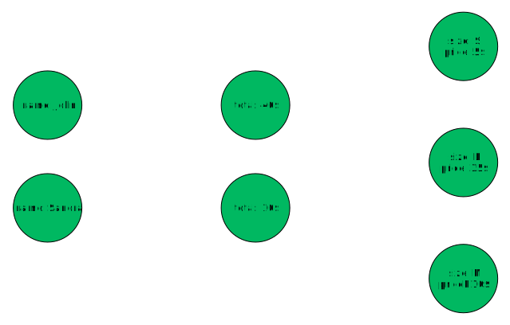
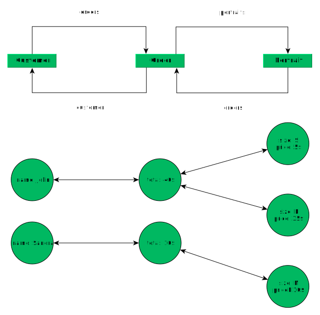

# Thinking in Terms of Graphs

In this guide we will explore how thinking in graphs can help you structuring your data.
The concept of graphs helps a lot with building a mental model of the data schema used in your application.

The goal of this guide is to introduce concepts and terminology useful
* when thinking about the data schema for your application
* when thinking about specific instantiations of your data schema

We will build a fictional e-commerce platform *Buy Kitten Portraits Online*.

## How Graphs help to think about Data

When you are working on a software project, you inevitably have to come up with a structure that works best for organizing your data.

With GraphQL, it is very easy to work with data schemas in the shape of a *graph*. Graphs are constructs that we already have a natural understanding for. It is not only possible to represent *entities* in a graph but also the *relations* between those entities.

We can think about data on two different levels:
* how is the data [structured](#structuring-your-data)?
* how does a [specific data item](#thinking-about-concrete-data) interact with other data items?.

If you want to achieve a clean design of your data schema, it proves advantageous to group your data into different *models* and define *relations* between them.

Then later, when thinking of your real data, you can think about indiviual *nodes* connected by *edges*.

## Structuring your Data Schema

When designing the data schema, we think of the general structure of our data and divide it in different categories called [Models](#models). We capture the interactions between two models using [relations](#relations).

> We want to sell awesome kitten portraits on our platform. What entities or processes are we dealing with in the real world that we have to keep track of? Let's list a few, including the properties we need to remember:

### Models

* `Customer`: the customer is king - we are interested in the *name*, the *address* and the *payment information* of our customers.
* `Portrait`: kitten portraits are our biggest capital - they have a *size* and a *price*.
* `Order`: an order consists of a *total price* and the *due date*

Let's visualize the progress we made so far on our data schema:

Now we have a good overview of the models that we need for our data. But how do they interact with each other? That's where the real action begins!

### Relations

Models on their own are pretty boring. We should think about how our models relate to each other. This is the meaning of a *relation*.

Let's look at a use case that we might encounter:
* A `customer` Sandra is `ordering` one `portrait`
* Another `customer` John is a recurring customer and very happy with our service. He is `ordering` multiple `portraits`

We can extract the following relations from this use case:

* *One* `customer` can make *multiple* `orders`
* *One* `order` can only be issued by *one* `customer`

We name this relation *customerOrders*. It consists of the field *orders* on the `Customer` model and the field *customer* on the `Order` model.

* *One* `order` contains *multiple* `portraits`
* *One* `portrait` can appear in *multiple* `orders`

We name this relation *ordersPortraits*. It consists of the field *portraits* on the `Order` model and the field *orders* on the `Portrait` model.

This is starting to get confusing... let's look at our current data schema to get a better understanding of our current situation:

## Thinking about concrete Data

Our current visualization helps us to think about all the models and relations for our application. But it doesn't include any information on the specific customers Sandra and John!

* Sandra is `ordering` one `portrait`
* John is `ordering` multiple `portraits`

### Nodes

To think of specific data items, we use the term *node*. A node contains actual information and is usually referred to using an `id`.

### Edges

When two nodes are related, we say that they are connected by an *edge*.

In our two use cases, Sandra is connected to one `order` node which in turn is connected to one `portrait` node. John is connected to one `order` node that is connected to multiple `portrait` nodes.

### Connection

All the edges for one specific relation combined form its *connection*.

## Results

Putting all the graphs together that we built, we get both a good broad overview of our models and also a good detailed view about Sandra and Johns context.

## Wrap up

Working with your data if it is structured as a graph helps a lot when trying to expand your data schema, or when exploring the context of a specific node.

We saw how we can group our data in different **Models**, whose **Fields** essentially define our data structures. Semantic dependencies between models are captured by **Relations**, which are a flexible concept as they support multiplicities for different scenarios.

If we think about a specific **Node**, we are interested in its context. Which **Edges** exist that connect it to other nodes? How does the **Connection** between the two according models look like?

Thinking in terms of graphs gives us an easier time understanding complex issues. That's why many aspects of our platform, like Permissions or our APIs, expand on this approach.
